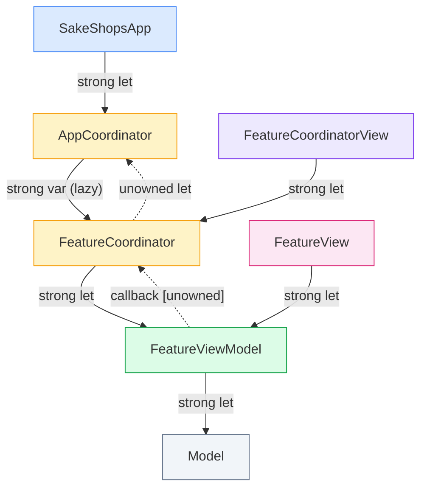

# ADR 0002: MVVM-C Architecture

## Status
Accepted

## Date
2026-06-01

## Deciders
Fernando Luna

## Context & Problem Statement

SakeShops needs a clear, testable architecture for a multi-screen SwiftUI app. SwiftUI provides `NavigationStack` and the `@Observable` macro but offers no out-of-the-box pattern for keeping navigation logic out of views or for injecting dependencies into ViewModels. We needed to decide how to structure Views, state, and navigation so that each layer can be developed and tested in isolation.

## Decision Drivers

* ViewModels must be testable without a running UI
* Views must not import or own navigation logic
* Dependencies (services, clients) must be injectable at a single composition root
* The pattern must remain approachable for a small team without a heavy framework

## Considered Options

* **Option 1: MVVM-C (Model – View – ViewModel – Coordinator)** — ViewModels own feature state and expose event callbacks; Coordinators wire those callbacks to navigation actions and inject dependencies; a single root coordinator owns the navigation stack.
* **Option 2: The Composable Architecture (TCA)** — Reducer-based unidirectional state management with built-in navigation and testing tools.
* **Option 3: Plain MVVM** — ViewModels own both feature state and navigation; views trigger navigation directly.

## Decision Outcome

Chosen option: **MVVM-C**, because it cleanly separates navigation from presentation with no third-party dependency, while keeping ViewModels independently testable via simple callback properties.

### Justification

TCA would provide strong correctness guarantees but introduces significant conceptual overhead that isn't warranted for a project of this scope. Plain MVVM conflates navigation with feature logic, making ViewModels harder to test in isolation. MVVM-C draws a clean boundary: ViewModels know *what happened*, Coordinators decide *where to go*, and the root coordinator owns the single source of truth for the navigation stack.

## Pros and Cons of the Chosen Option

### 🟢 Positive Consequences

* ViewModels have no UI or navigation framework dependency — straightforward to unit test in isolation.
* All navigation decisions live in coordinators, making flows easy to follow and change without touching views.
* New screens slot in by adding a route case and a coordinator — the pattern is mechanical and consistent.
* Zero third-party dependencies for the architectural layer itself.

### 🔴 Negative Consequences

* Boilerplate per screen: a coordinator, a coordinator view, and wired-up callbacks, even for simple destinations.
* Deep link handling and complex modal stacks require more manual orchestration than a dedicated navigation framework.
* Feature coordinators hold a back-reference to the root coordinator, which requires attention to object lifetime.

---

## Layer Responsibilities

| Layer | Responsibility | Navigation knowledge |
|---|---|---|
| Model | Data representation | None |
| ViewModel | Feature state and user intent | None — exposes event callbacks for navigation triggers |
| View | Render state, forward user actions to ViewModel | None |
| Coordinator | Wire ViewModel callbacks to navigation actions | Decides where to go; calls into the root coordinator |
| Root Coordinator | Own the navigation stack; vend and lifetime-manage feature coordinators | Single source of truth for the stack |

---

## Reference Graph

Generic ownership and reference pattern that every feature must follow. Use it as a checklist when adding a new screen.

| Arrow | Type | When |
|---|---|---|
| `──►` solid | Strong | Default for all owned references |
| `··►` dotted | Unowned | Back-reference from child coordinator to `AppCoordinator`; navigation callbacks stored in ViewModel |
| `@State` on `FCV` | SwiftUI strong | When `FeatureCoordinatorView` constructs the coordinator itself (ephemeral push destination) |
| `let` on `FCV` | Strong | When `AppCoordinator` owns the coordinator's lifetime (persistent screen) |

### Checklist for a new feature

1. Add a case to `AppRoute` (carry any model the destination needs as an associated value).
2. Create `FeatureCoordinator` — `final class`, `private unowned let app: AppCoordinator`, `let viewModel: FeatureViewModel`. Wire `viewModel.onXxx` callbacks to `app.push(...)` in `init`.
3. Create `FeatureCoordinatorView` — use `let coordinator:` when `AppCoordinator` owns the lifetime (persistent); use `@State private var coordinator:` when the view constructs it inside `navigationDestination` (ephemeral).
4. Create `FeatureViewModel` — `@Observable @MainActor final class`. Declare `var onXxx: (Payload) -> Void = { _ in }` for each navigation trigger. Views call named methods (`func xxxTapped()`), never the callback directly.
5. Create `FeatureView` — `let model: FeatureViewModel`. No `@Bindable`, no `@EnvironmentObject`.
6. Add a `navigationDestination` branch in `AppCoordinatorView`.
7. If the coordinator must survive multiple child views, add a lazy accessor on `AppCoordinator` and release it in `releaseStaleCoordinators()` when its route leaves the stack.
